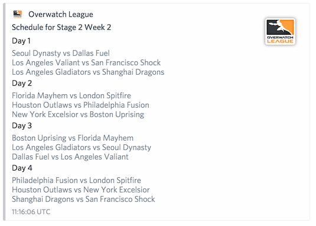

# OWL Bot

Quick and dirty.

Create a `config` (see `config.example`) for your token.

## Commands

`!status` - Get current match or the next match

`!next` - Get next match

`!live` - If match is on-going, will update message until there are no more matches. Deletes the message after the fact

`!schedule <stage#> <week#>` - Lists games for given stage/week. Skip arguments for current stage/week.

## Screenshots

